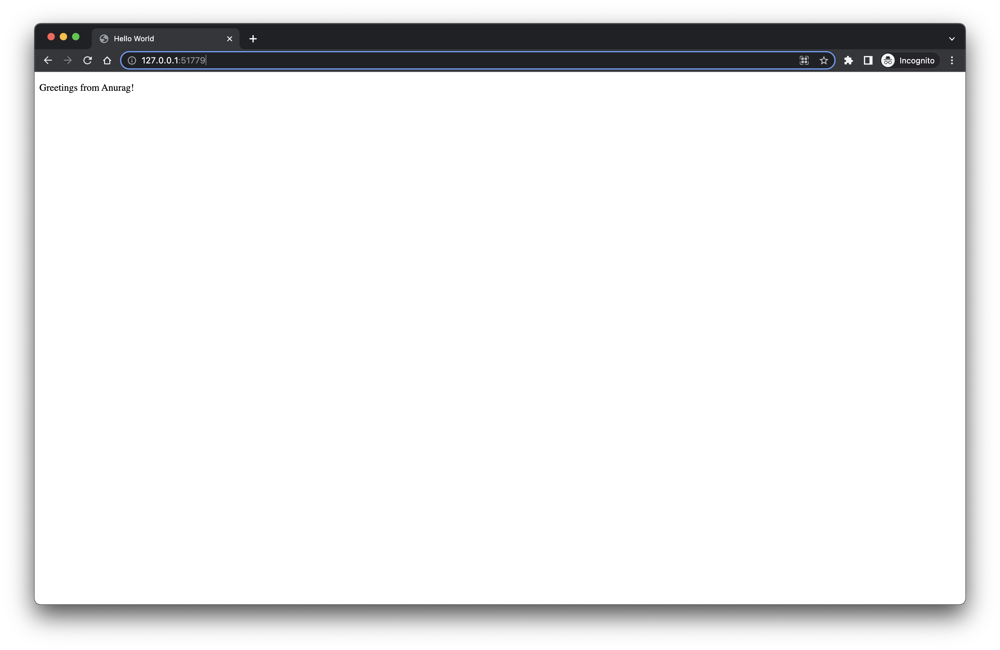
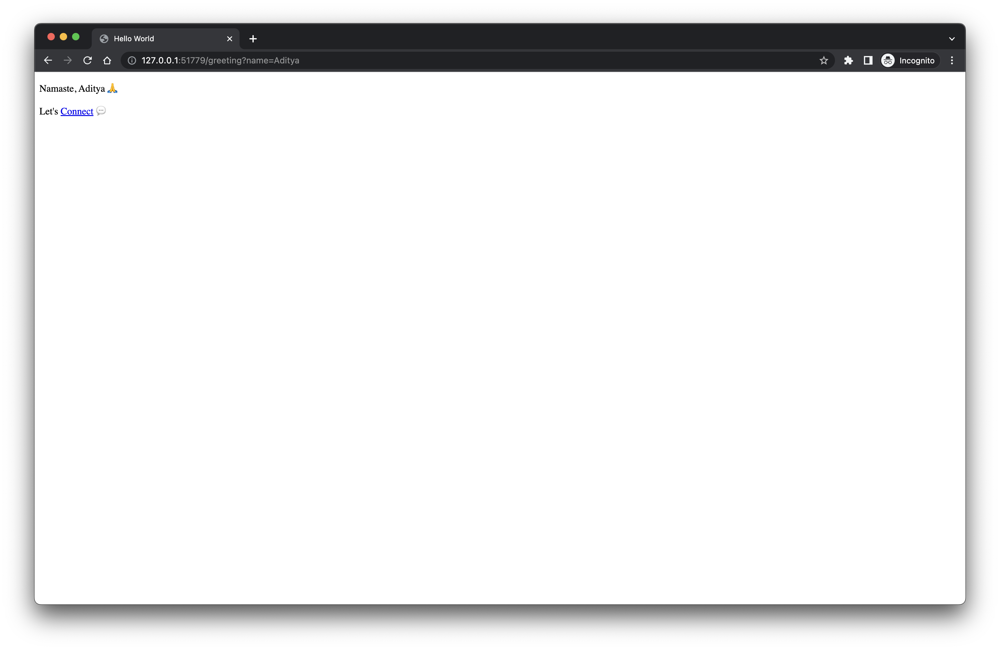

# Spring boot hello world
Deploy Spring Boot web application on Kubernetes using [Eclipse JKube](https://www.eclipse.org/jkube/)

## Requirements:

- JDK 17+
- Docker
- Kubernetes Cluster

## How to Deploy application on cluster

1. Package application
```shell
$ ./mvnw clean package
```

2. Start your cluster and expose docker daemon
```shell
$ minikube start
$ eval $(minikube -p minikube docker-env)
```

3. Deploy application on cluster
```shell
$ ./mvnw k8s:build k8s:resource k8s:apply
```

4. Check application deployment, pod and service status
```shell
$ kubectl get deploy
NAME                      READY   UP-TO-DATE   AVAILABLE   AGE
spring-boot-hello-world   1/1     1            1           10s

$ kubectl get po
NAME                                      READY   STATUS    RESTARTS   AGE
spring-boot-hello-world-f8bc74ffc-4dp9k   1/1     Running   0          24s

$ kubectl get svc
NAME                      TYPE        CLUSTER-IP      EXTERNAL-IP   PORT(S)          AGE
spring-boot-hello-world   NodePort    10.108.31.143   <none>        8080:32644/TCP   48s
```
As you can see our application is running successfully

5. Access application
```shell
$ minikube service spring-boot-hello-world --url
http://127.0.0.1:51284
❗Because you are using a Docker driver on darwin, the terminal needs to be open to run it.
```

Head over to above url to access the application, and you can see it like 👇

- `/` endpoint


- `<url>/greeting?name=User` endpoint


6. Delete Deployment
```shell
$ ./mvnw k8s:undeploy
```